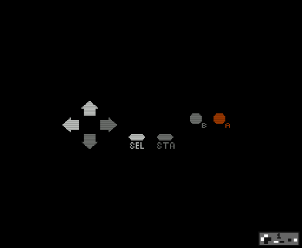

# NES AI Challenge

## Can your favorite AI Model produce this simple and well-known NES subroutine?
* Here's the challenge:  write one or more prompts to convince an AI Model to generate a ca65-compatible subroutine named `readjoy` to populate a variable named `buttons` with the current state of the buttons on player 1's controller.
* Once you have this subroutine, paste it into `readjoy.inc` to test it out.

## Building
* Simply run `make`
    * Requires make, ca65, and ld65 to be included in your PATH.
## File Summary
* `nes_ai_challenge.s`
    * Complete source code in 6502 assembly.
* `readjoy.inc`
    * Generated results from various models.
    * The example implementation, from [nesdev.org](https://www.nesdev.org/wiki/Controller_reading_code), is enabled by default.
* `system.inc`
    * Canonical names for NES registers and OAM data layout.
* `nrom.cfg`
    * Linker configuration for a basic [NES NROM](https://www.nesdev.org/wiki/NROM) rom file.
* `nes_ai_challenge.nes`
    * Prebuilt example rom file.

## But why?
* This is my favorite test for any AI Model.  I've noticed that in most of my results, while the subroutines generated involve the $4016/JOYPAD1 register, the actual logic simply doesn't work.  Microsoft Copilot is the notable exception thus far, producing working code with correct results.  I find it very interesting that this register made it into the corpus, but somehow the implementation didn't.
* It's interesting to compare the flawed solutions and figure out where the faults manifest.
* Have fun!